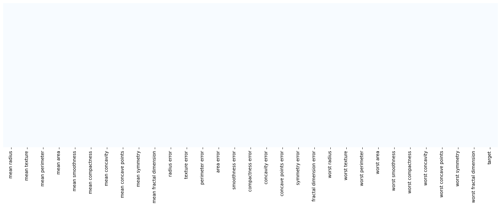
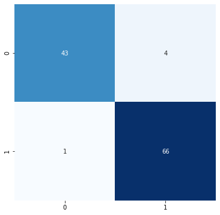

# Breast Cancer Classifier

The objective of this kernel is to create a classification model which classifies tumors into benign and malignant based on 30 features. The data set is included in the scikit-learn library under the module "load_breast_cancer".

The features in the data set are as follows:
       'mean radius', 'mean texture', 'mean perimeter', 'mean area',
       'mean smoothness', 'mean compactness', 'mean concavity',
       'mean concave points', 'mean symmetry', 'mean fractal dimension',
       'radius error', 'texture error', 'perimeter error', 'area error',
       'smoothness error', 'compactness error', 'concavity error',
       'concave points error', 'symmetry error',
       'fractal dimension error', 'worst radius', 'worst texture',
       'worst perimeter', 'worst area', 'worst smoothness',
       'worst compactness', 'worst concavity', 'worst concave points',
       'worst symmetry', 'worst fractal dimension'
 
Our Classification Analysis kernel consists of 7 steps:

### Step 0 (dubbed Step 0 in our house because it is a preparatory step) - Import the Libraries:
in addition to the scikit-learn library whhich we use to perform the classification analysis, we also use several other packages and modules:

-**Pandas**:used for data structures and operations for manipulating numerical tables
-**Numpy**: used for numerical analysis
-**matplotlib.pyplot**: used for plotting data
-**seaborn**: used for data visualization (used on top of matplotlib library)
-**sklearn**: used in our kernel to split the set into a training and a testing set, to create the model, to perform grid search to find the best hyper parameters, and to visualize the results.

### Step 1 - Import the Dataset:
We imported the data from the sklearn library, and we load it into a pandas DataFrame object.
The column names are also included in the data. The keys of the data can be seen using the keys method:
```data_set.keys()```

### Step 2 - Visualize Data:
In this step we checked our data for null values using a heatmap from seaborn as follows:
```sns.heatmap(df.isnull(), yticklabels = False, cbar = False, cmap="Blues")```


We also check if there is any correlation between the variables and we explore the dataset to get a feel of it.

### Step 3 - Create Training and Testing Set: 
We split our data set into a training and testing sets. We use 20% for testing the classifier:

- **X_train**: Contains the independent variables used for training
- **y_train**: Contains the dependent variables used for training
- **X_test**:	Contains the independent variables used for testing
- **y_test**:	Contains Dependent variables used for testing

### Step 4 - Scale Data:
We scale the data by subtracting the minimum of each field and dividing over the range.

### Step 5 - Finding best C and gamma and training model:
We use GridSearchCV from sklearn model selection to find the best C and gamma values for the model. The parameters that we test are as follows:
```
param_grid={'C':[0.1,1,10,100], 'gamma':[10,1,0.1,0.01,0.001], 'kernel':['rbf']}
```

Then we fit the model to our trainng set.

### Step 6 - Evaluate Model:
We classify the data and we use a confusion matrix to visualize results. We also generate a classification report which gives you the f1 score.


